# Lab 01 - Formação de Sessão eBGP e Seleção de Rotas

## Objetivo

Neste laboratório foi realizada a implementação de uma sessão eBGP entre três Sistemas Autônomos utilizando MikroTik CHR. Durante os testes foram analisados o estabelecimento das sessões BGP, o anúncio de prefixos, o processo de seleção de rotas e a influência do atributo AS-PATH na escolha do melhor caminho.

---

# Topologia

Neste cenário foram utilizados três roteadores MikroTik CHR interligados em topologia de anel. O OSPF foi utilizado como protocolo IGP para garantir a conectividade entre os enlaces, enquanto o BGP foi empregado para troca de rotas entre os Sistemas Autônomos.

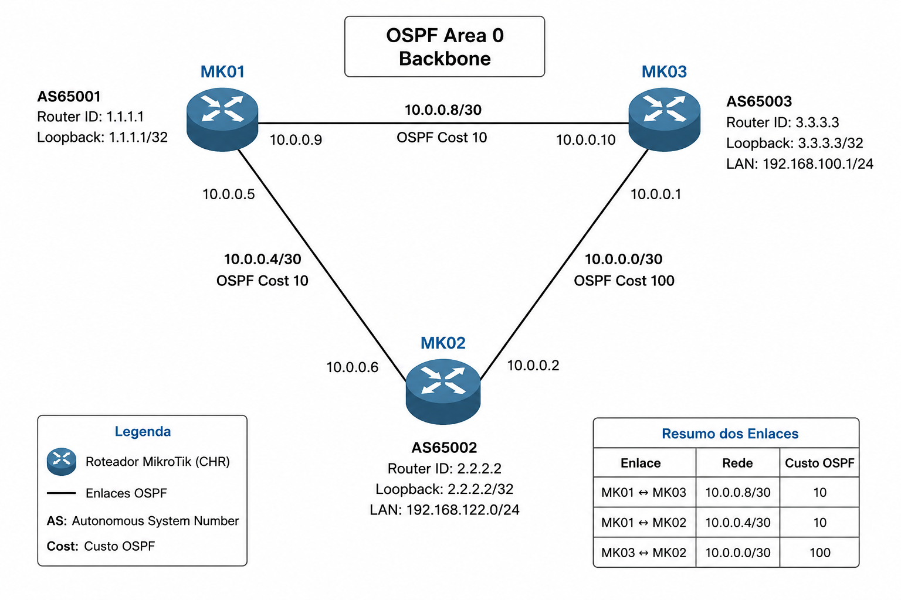

---

# 1. Verificação das Sessões BGP

Após a configuração das conexões, foi validado o estabelecimento das sessões eBGP entre os roteadores.

### MK01

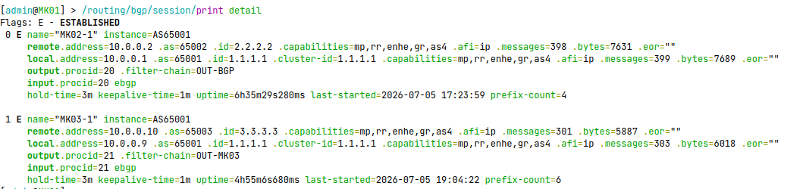

### MK02

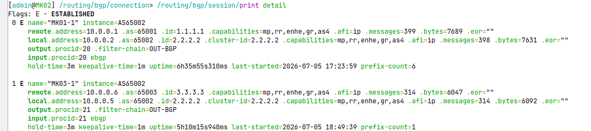

### MK03

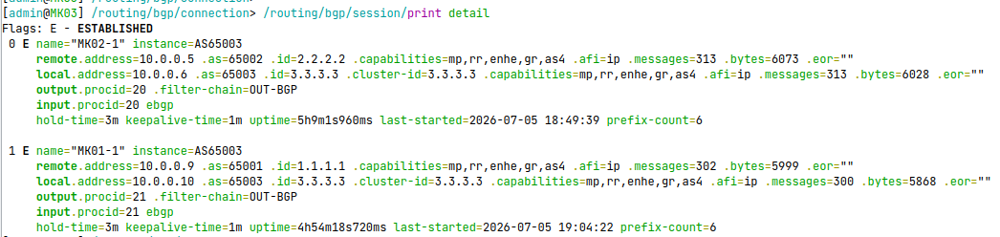

---

# 2. Rotas Aprendidas via BGP

Nesta etapa foi verificada a tabela de roteamento de cada roteador para confirmar o recebimento dos prefixos anunciados pelos AS vizinhos.

### MK01

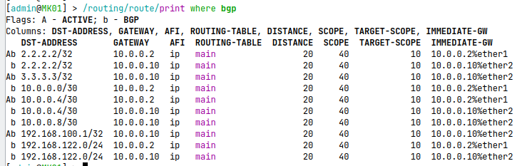

### MK02

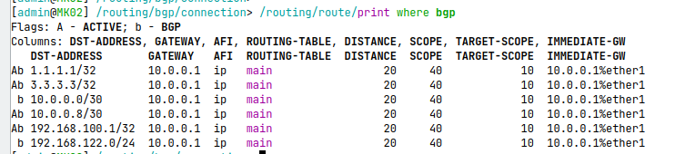

### MK03

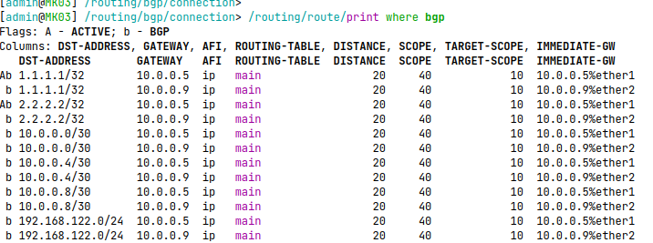

---

# 3. Escolha do Melhor Caminho

Foi analisado o processo de seleção da melhor rota para alcançar o prefixo 1.1.1.1/32. Neste momento é possível observar a diferença entre a rota ativa e a rota candidata.

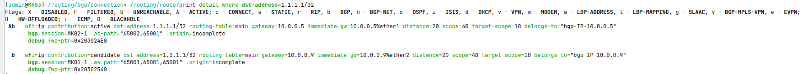

---

# 4. Prefixos Anunciados

Validação dos anúncios enviados por cada Sistema Autônomo aos seus vizinhos.

### MK01

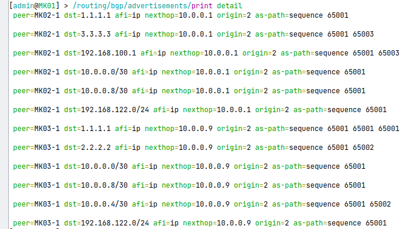

### MK02

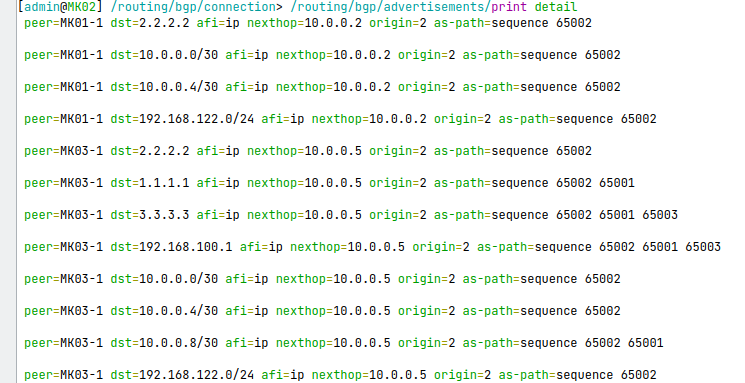

### MK03

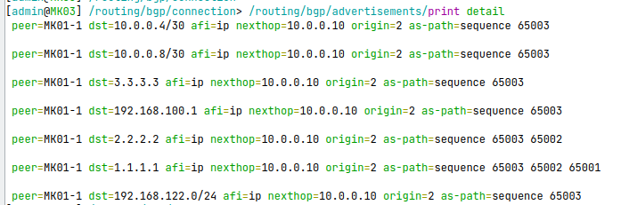

---

# 5. Políticas BGP

Neste laboratório foram utilizadas Routing Filters para controlar o anúncio de rotas e aplicar o atributo AS-PATH Prepend.

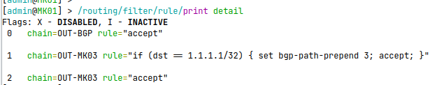

---

# 6. Configuração das Sessões

Validação das conexões BGP, neste exemplo o MK01

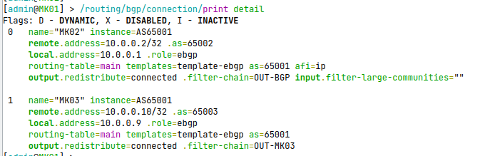

---

# 7. Validação da Engenharia de Tráfego

Após a aplicação do AS-PATH Prepend, foi realizado um traceroute para confirmar que o tráfego passou a utilizar o caminho esperado.

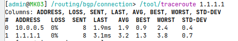

---

# Conclusão

Ao final deste laboratório foi possível compreender:

- Formação de sessões eBGP.
- Troca de rotas entre Sistemas Autônomos.
- Funcionamento do atributo AS-PATH.
- Aplicação do AS-PATH Prepend.
- Processo de seleção da melhor rota.
- Relação entre BGP e OSPF na resolução do next-hop.
- Validação prática da engenharia de tráfego por meio de traceroute.
