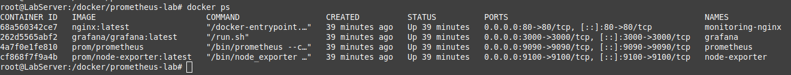
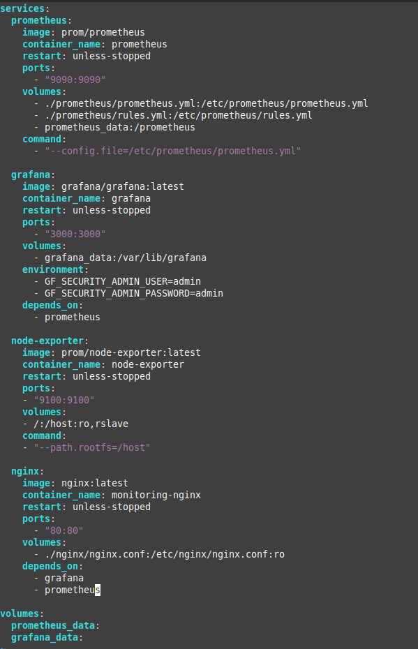
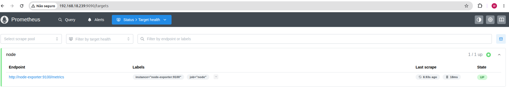
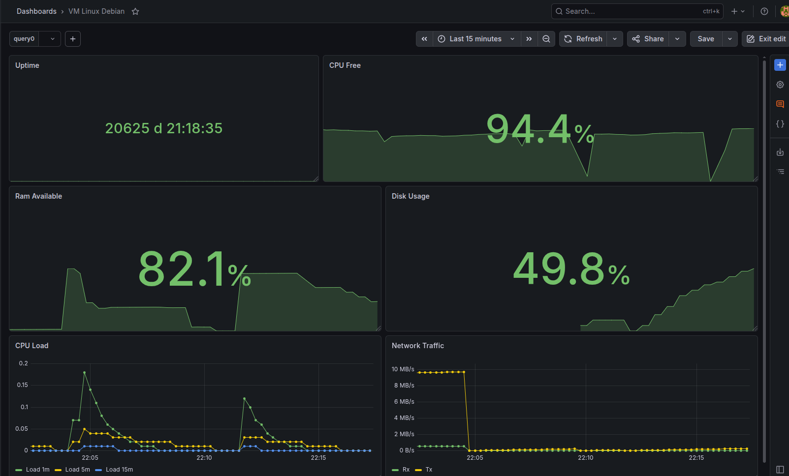

#  Docker Monitoramento com Prometheus + Grafana + Node Exporter

Este projeto tem como objetivo a criação de um ambiente completo de monitoramento utilizando Docker Compose, Prometheus, Grafana e Node Exporter.

---

##  Tecnologias utilizadas

- Docker
- Docker Compose
- Prometheus
- Grafana
- Node Exporter

---

##  Arquitetura

O ambiente foi montado utilizando Docker Compose, com os seguintes serviços:

- **Prometheus** → coleta e armazenamento de métricas
- **Grafana** → visualização dos dashboards
- **Node Exporter** → coleta métricas do sistema operacional host

---

##  Instalação

O ambiente foi provisionado utilizando `docker-compose`, centralizando toda a stack de monitoramento.

**Dashboards criados**

O Grafana foi configurado com os seguintes painéis:

CPU Usage
Memory Available
Disk Usage
System Load (1m / 5m / 15m)
Network Traffic (RX / TX)
Uptime

**Conceitos aplicados**

Durante o projeto foram abordados:

Infraestrutura como código com Docker Compose
Coleta de métricas com Prometheus
Exportação de métricas via Node Exporter
Visualização e criação de dashboards no Grafana
Criação de métricas derivadas (recording rules no Prometheus)

**Evidências do projeto**

Containers em execução

Docker Compose configurado

Prometheus ativo coletando métricas

Dashboard Grafana com métricas do sistema

