**Laboratório Linux - lsof e ss**

**Objetivo**

Estudar e praticar os comandos lsof e ss, amplamente utilizados em ambientes Linux para troubleshooting, identificação de processos, análise de portas em uso e monitoramento de conexões de rede.

**lsof**

**O que é o lsof**

O comando lsof (List Open Files) permite identificar arquivos, diretórios, dispositivos e conexões abertas por processos em execução.

No Linux, conexões de rede também são tratadas como arquivos, tornando o lsof uma ferramenta extremamente útil para análise e troubleshooting.

**Visualização geral**

**Comando utilizado:**

**lsof**

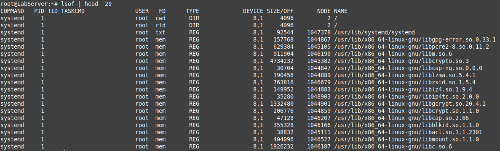

**Identificando processos utilizando uma porta**

Comando utilizado:

**lsof -i :443**

Resultado obtido:

Porta HTTPS em uso pelo serviço Nginx.

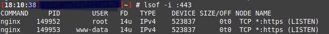

**Arquivos abertos pelo Asterisk**

Comando utilizado:

**lsof -c asterisk**

Resultado obtido:

Diversos módulos carregados pelo Asterisk.
Arquivos relacionados ao funcionamento da aplicação.

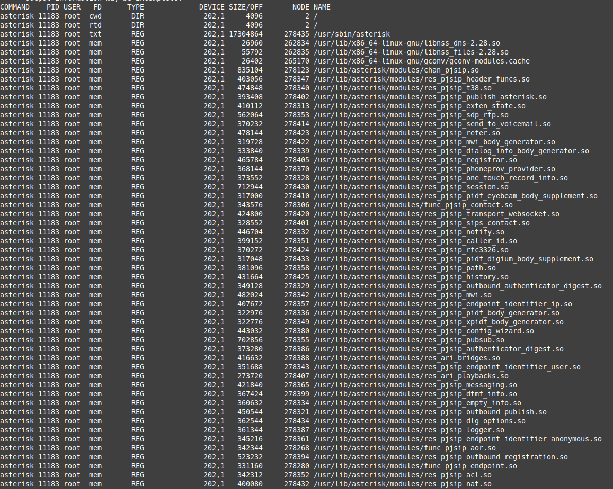

**Conexões TCP estabelecidas**

Comando utilizado:

**lsof -iTCP -sTCP:ESTABLISHED**

Objetivo:

Identificar conexões ativas entre serviços e clientes.
Identificando quem mantém um arquivo aberto

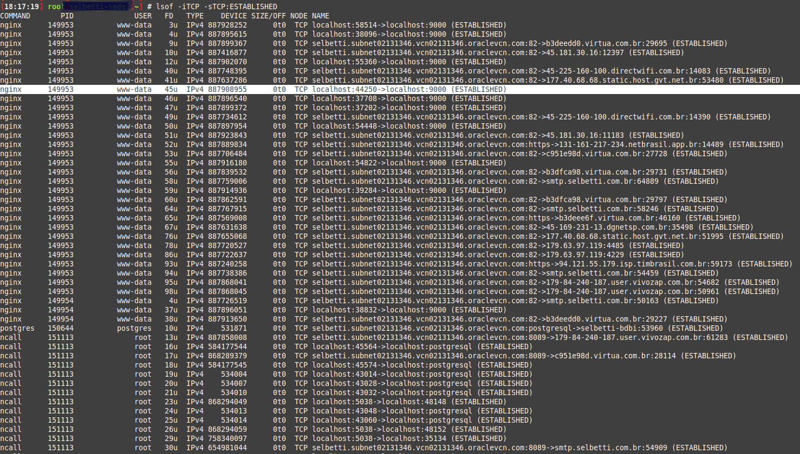

Comando utilizado:

**lsof /caminho/do/arquivo**

Objetivo:

Descobrir qual processo está utilizando determinado arquivo.
Arquivos removidos ainda ocupando espaço em disco

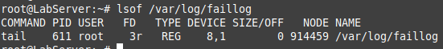

Comando utilizado:

**lsof | grep deleted**

Resultado obtido:

Nenhum arquivo removido permanecia aberto por processos.

Esse comando é muito útil quando o disco permanece ocupado mesmo após a exclusão de arquivos.

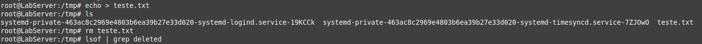

Arquivos abertos por um PID específico

Comando utilizado:

**lsof -p PID**

Objetivo:

Identificar todos os recursos utilizados por um processo específico.
Processos utilizando um diretório

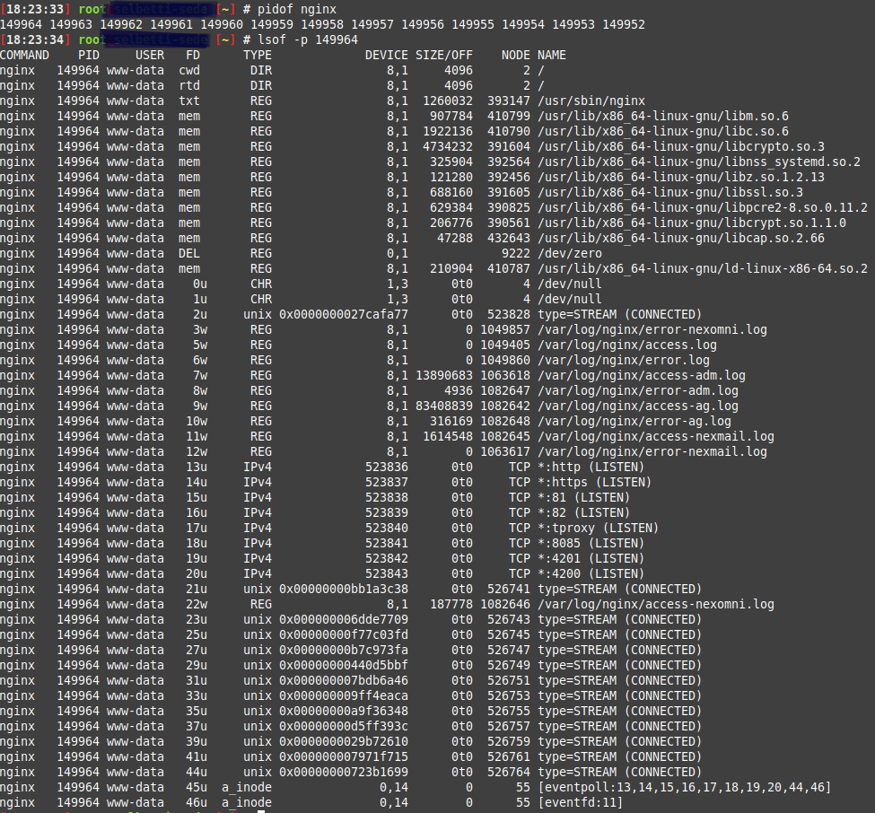

Comando utilizado:

**lsof +D /diretorio**

Objetivo:

Identificar quais processos estão utilizando arquivos dentro de um determinado diretório.

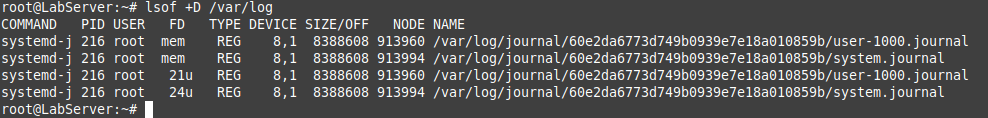

**ss**
**O que é o ss**

O comando ss (Socket Statistics) é utilizado para exibir informações sobre conexões TCP e UDP.

Atualmente é considerado o sucessor do comando netstat, oferecendo melhor desempenho e mais informações em ambientes Linux modernos.

Visualização geral das conexões

Comando utilizado:

**ss -a**
Portas em escuta

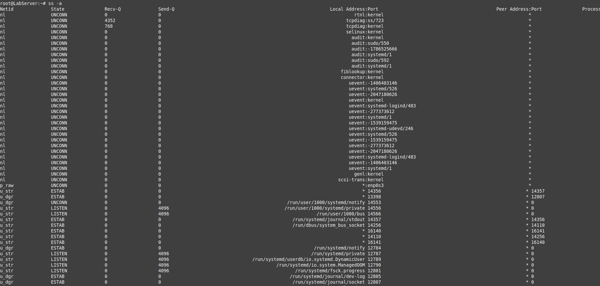

Comando utilizado:

**ss -tulpn**

Parâmetros utilizados:

t = TCP
u = UDP
l = LISTEN
p = Processo
n = Não resolver nomes

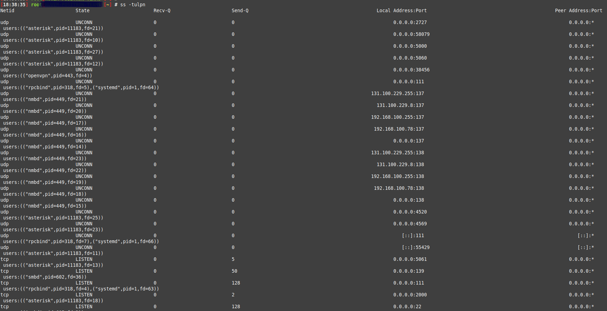

Identificando serviços na porta 443

Comando utilizado:

**ss -tulpn | grep :443**

Objetivo:

Identificar rapidamente qual processo está escutando na porta HTTPS.

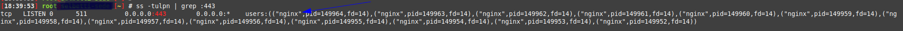

Identificando serviços PostgreSQL

Comando utilizado:

ss -tulpn | grep :5432

Resultado obtido:

Porta 5432 utilizada pelo PostgreSQL.

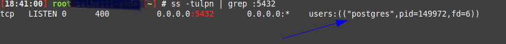

Identificando portas SIP do Asterisk

Comando utilizado:

**ss -tulpn | egrep '5060|5061'**

Objetivo:

Verificar portas SIP em utilização.
Conexões estabelecidas

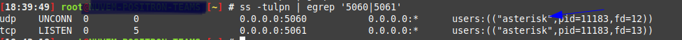

Comando utilizado:

**ss -tan state established**

Objetivo:

Visualizar conexões TCP ativas.

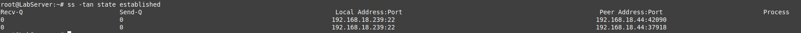

Conexões relacionadas ao PostgreSQL

Comando utilizado:

**ss -tan | grep 5432**

Objetivo:

Monitorar conexões do banco de dados.
Estatísticas resumidas das conexões

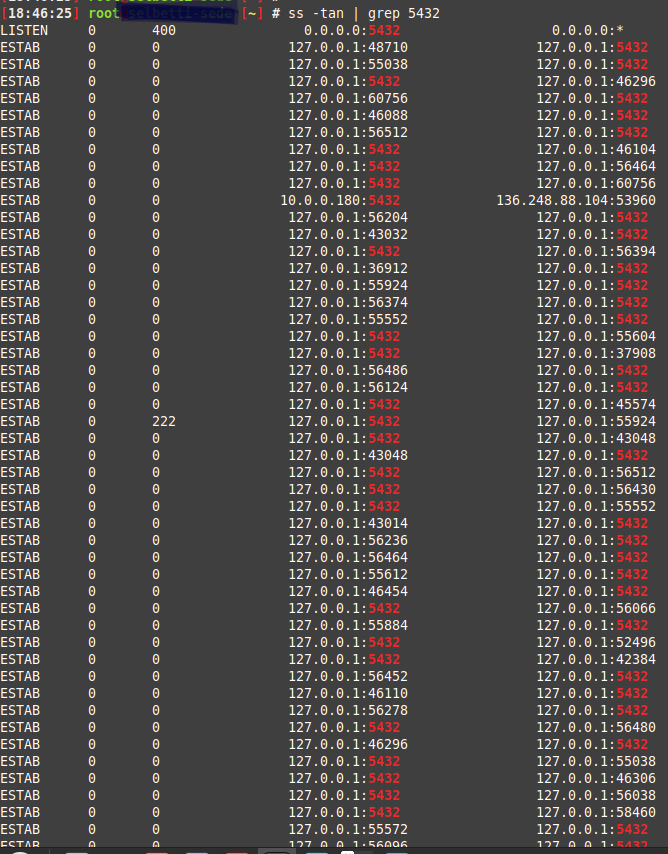

Comando utilizado:

ss -s

Resultado obtido durante o laboratório:

Total: 99
TCP: 4 (estab 2, closed 0, orphaned 0, timewait 0)

UDP: 1
TCP: 4
INET: 5

Objetivo:

Obter uma visão geral do estado das conexões do sistema.

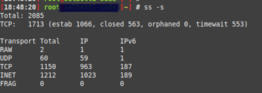

**Conclusão**

Durante este laboratório foi possível praticar duas ferramentas fundamentais para administração de servidores Linux.

**lsof**

Utilizado para:

Identificar processos utilizando portas.
Verificar arquivos abertos.
Analisar recursos utilizados por processos.
Localizar arquivos removidos ainda ocupando espaço em disco.

**ss**

Utilizado para:

Identificar portas em escuta.
Monitorar conexões TCP e UDP.
Verificar estados das conexões.
Realizar troubleshooting de aplicações e serviços.

Esses comandos fazem parte do conjunto de ferramentas utilizadas diariamente em atividades de administração de sistemas, análise de incidentes e troubleshooting em ambientes de produção.

Estudar e praticar os comandos lsof e ss, amplamente utilizados em ambientes Linux para troubleshooting, identificação de processos, análise de portas em uso e monitoramento de conexões de rede.

