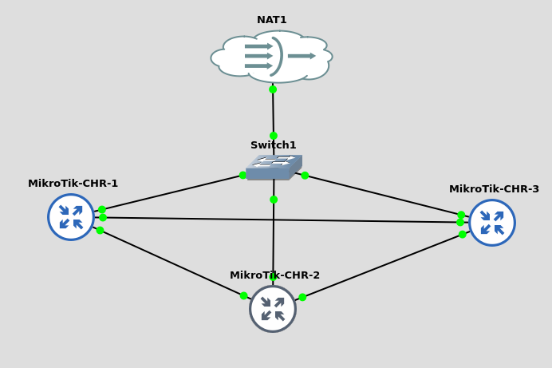
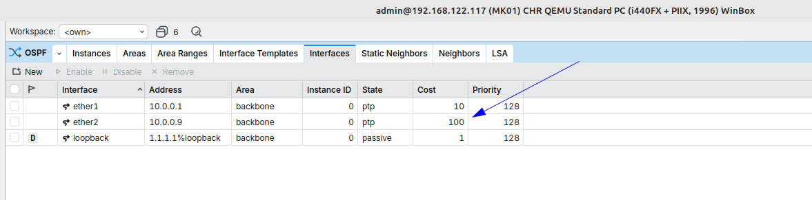
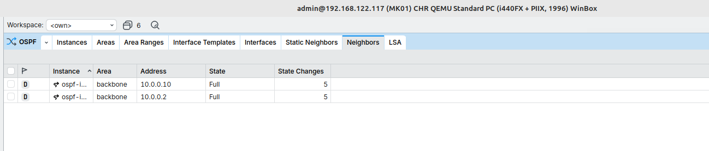
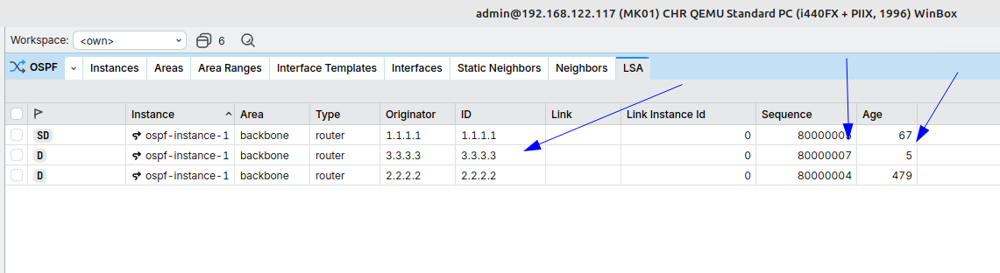

**Laboratório OSPF com MikroTik CHR**

**Objetivo**

Este laboratório teve como objetivo estudar o funcionamento do protocolo OSPF (Open Shortest Path First), compreendendo a formação de vizinhança, cálculo de rotas baseado em custo, propagação de LSAs e convergência da rede diante de falhas.

**Topologia Utilizada**

Foi utilizada uma topologia em anel composta por três roteadores MikroTik CHR.

A estrutura em anel permite a existência de caminhos redundantes, possibilitando ao OSPF recalcular rotas automaticamente em caso de falha de um enlace.

**Configuração dos Custos OSPF**

Foram configurados custos diferentes nos enlaces para influenciar a escolha do melhor caminho pelo algoritmo SPF.

Exemplo:
    • Enlace principal: custo 10
    • Enlace secundário: custo 100
    
Dessa forma, o OSPF passa a preferir o caminho de menor custo para encaminhamento do tráfego.

**Formação de Vizinhança (Neighbors)**

Após a configuração do protocolo, foi validada a formação das adjacências entre os roteadores.
Através do comando de verificação de vizinhos foi possível confirmar o estado FULL entre os equipamentos, indicando sincronização completa das informações OSPF.

**Análise da LSDB (Link State Database)**

Foi realizada a análise da base de dados de estado de enlace (LSDB), verificando os Router LSAs anunciados pelos roteadores participantes da área OSPF.
A LSDB contém as informações utilizadas pelo algoritmo SPF para calcular os melhores caminhos da rede.

**Teste de Escolha de Caminho**

Foi executado um traceroute entre os roteadores para validar o caminho selecionado pelo OSPF.
Devido aos custos configurados, o protocolo escolheu o enlace de menor custo como rota preferencial.

**Simulação de Falha de Enlace**

Para validar a capacidade de convergência do protocolo, foi simulada a indisponibilidade de um dos enlaces da topologia.
Durante o teste foi possível observar:
    • Perda da adjacência OSPF.
    • Atualização dos LSAs.
    • Recalculo da árvore SPF.
    • Seleção automática do caminho alternativo.

**Atualização dos LSAs**

Após a alteração da topologia, foi possível observar a geração de novos LSAs, incluindo atualização dos campos Sequence Number e Age.
Essas alterações demonstram o mecanismo utilizado pelo OSPF para propagar mudanças de topologia entre os roteadores da área.

**Conclusão**

Durante este laboratório foi possível compreender os principais conceitos do protocolo OSPF:

    • Formação de vizinhanças.
    • Troca de LSAs.
    • Construção da LSDB.
    • Cálculo de rotas através do algoritmo SPF.
    • Influência do custo OSPF na escolha de caminhos.
    • Convergência automática em caso de falha.
    • Utilização de caminhos redundantes em topologias em anel.
      
O resultado demonstrou a capacidade do OSPF de adaptar-se dinamicamente às mudanças da rede, mantendo a conectividade através de rotas alternativas.
